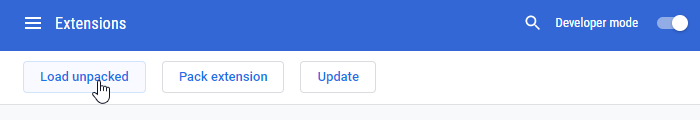
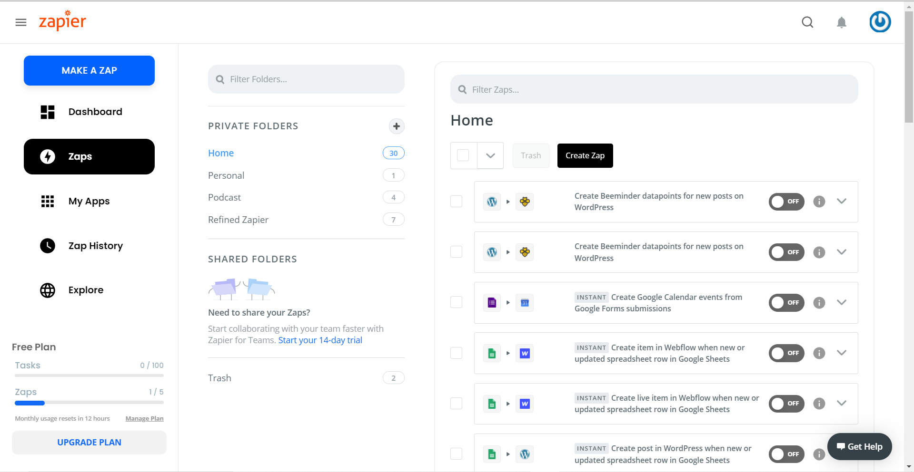
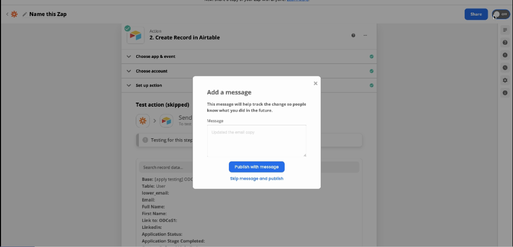
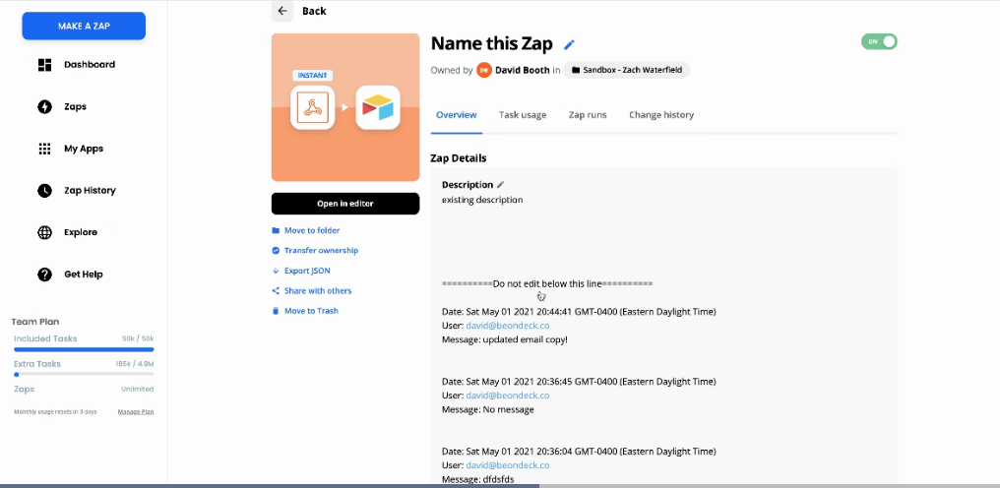
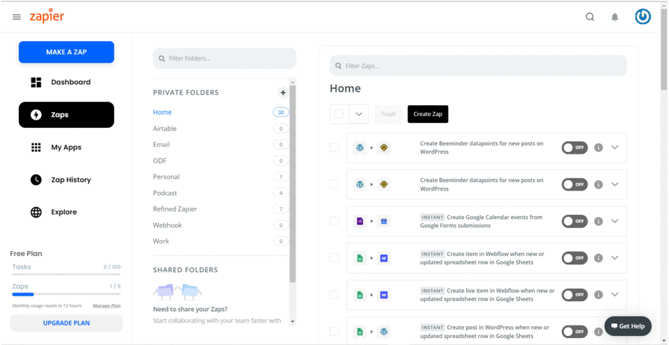

# Refined Zapier

> The inspiration and base for this project was take from [Refined Github](https://github.com/sindresorhus/refined-github).

## Install (coming soon)

## Chrome

1. [Download Chrome Extension Zip](https://github.com/zlwaterfield/refined-zapier/releases/download/0.0.1/refined-zapier-0.0.1.zip)
2. Open the "Extensions" page (chrome://extensions/) in the browser and turn on the "Developer mode".
3. In Settings > Extensions click "Load unpacked extension" and select the `distribution/` subfolder of this repository.
<table>
	<tr>
		<th width="100%">
			
 Enable developer mode and Load unpacked extension
			

</table>

## Highlights
<table>
	<tr>
		<th width="50%">
			
 Improve Zapier UX by 10x 
			

		<th width="50%">
			
 Track changes with commit messages
			

	<tr>
		<th width="50%">
			
 Detailed history of all the commits
			

		<th width="50%">
			
 Filter by Folder or Zap
			

  <tr>
		<th width="50%">
			
 Name your zap before publishing
			

</table>

<!--
############################
  Descriptions style guide
############################

- Starts with: "(Refined Zapier) <verb in third person> ..."
- Ends with period (inside link or parens, if present, like this.)
- Keyboard shortcuts must follow:
	- "Adds a keyboard shortcut to ...: <kbd>key1</kbd> <kbd>key2</kbd>"
	- "Adds keyboard shortcuts to ...: <kbd>a</kbd> and <kbd>alt</kbd> <kbd>a</kbd>"
- Use smart apostrophes: ’ instead of '
- Keep it concise.

#####################################
  Demo screenshots/gifs style guide
#####################################

- Try cleaning up the page by disabling nearby features or hiding clutter, e.g. everything below this tab bar has been hidden: https://user-images.githubusercontent.com/1402241/55089736-d94f5300-50e8-11e9-9095-329ac74c1e9f.png
- If possible, zoom at 200% before taking a screenshot (native retina screens are fine at 100%)
- If changes are subtle, add a before/after comparison using the arrows from https://user-images.githubusercontent.com/1402241/34438653-f66535a4-ecda-11e7-9406-2e1258050cfa.png
- Include some visual context if the feature targets small UI elements, e.g.: https://user-images.githubusercontent.com/1402241/108955170-52d48080-7633-11eb-8979-67e0d3a53f16.png

Thanks for contributing! 🦋🙌

-->

### Zap List
-  🔦  [Folder searching]()
-  🔍  [Details on hover]()

### Zap Editor
-  ✋  [Commit messages]()
-  ✋  [Prevent creating Zaps with no name]()

### Zap Details
-  ✋  [Format Zap description]()

### Styling
-  🎨 Load fonts (Poppins)

-  🎛 [Improve the styling of Zapier sidebar.]()
-  🎛 [Improve the styling of the Zap list.]()
-  🎛 [Improve the styling of the Zap Editor]()

<!-- Refer to style guide above. Keep this message between sections. -->

## Contribute

Read the [contribution guide](contributing.md) and join the [contributors](https://github.com/zlwaterfield/refined-zapier/graphs/contributors)!
